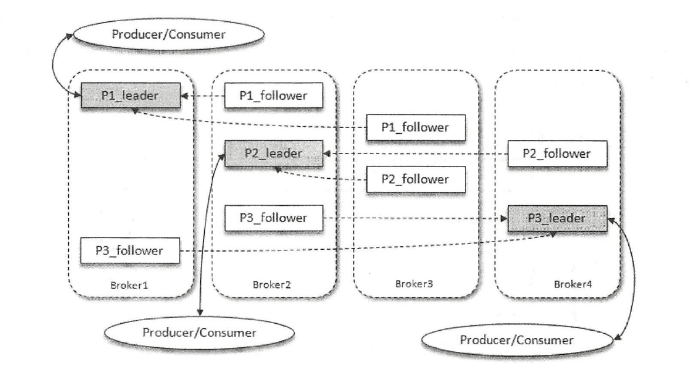

# Kafka


## 一. 初始 kafka

分布式的基于发布订阅的消息队列

- 消息系统：解耦、冗余存储、流量削峰、缓冲、异步通信、扩展性、可恢复

- 存储系统
- 流式处理平台


### 1.1 基本概念

- consumer：消费者
- producer：生产者
- broker：服务代理节点 (服务器)
- topic：主题 (有多个分区，可以横跨多个 broker)
- partition：分区 (一个日志文件，通过 offset 保证消息在分区的有序性)
- replica：副本 (leader, follower)


4 个 broker，某个主题有 3 个分区，每个分区有 1 个 leader 和 2 个 follower



- AR (assigned replicas)：所有副本

- ISR (in-sync replicas)：与 leader 保持一定程度同步的副本

- OSR (out-of-sync replicas)：与 leader 滞后过多的副本

​		$AR = ISR + OSR (通常为 0)$

- HW (high watermark)：高水位，表示一个特定的消息偏移量，消费者只能拉取到该偏移量之前 (防止消息还没同步到副本就被消费了)

- LEO (log end offset)：当前日志文件中下一条待写入消息的偏移量

​		ISR 集合中最小的 LEO 就是分区的 HW

​		同步复制要求所有能工作的 follower 副本都复制完，这条消息才会被确认为已成功提交


### 1.2 安装配置


### 1.3 生产与消费

```sh
# zookeeper 2181
# kafka 9092

# 创建一个分区数为 4，副本因子为 3 的主题 topic-demo
kafka-topics.sh --zookeeper localhost:2181/kafka --create --topic topic-demo --replication-factor 3 --partitions 4

# 展示主题信息
kafka-topics.sh --zookeeper localhost:2181/kafka --describe --topic topic-demo

# 订阅主题
kafka-console-consumer.sh --bootstrap-server localhost:9092 --ttopic topic-demo

# 发送消息
kafka-console-producer.sh --broker-list localhost:9092 --topic topic-demo

```


### 1.4 服务端参数配置


## 二. 生产者


### 2.1 客户端开发


**一些能配置的参数**

`ProducerConfig`

- bootstrap.servers：生产者连接 kafka 集群需要的 broker 地址
- key/value.serializer：broker 接收到消息必须以字节数组的形式存在
- client.id：生产者对应的客户端 id

producer 是线程安全的


**消息发送**

`ProducerRecord`

- topic
- partition
- headers
- key：可以用来计算分区号把消息发往特定的分区
- value：消息体
- timestamp：消息的时间戳 (消息创建时间、消息追加到日志文件的时间)


发消息的三种模式

- 发后即忘 (fire-and-forget)
- 同步 (sync)
- 异步 (async)


发消息中的异常

- 可重试异常：可以配置重试次数
- 不可重试异常


